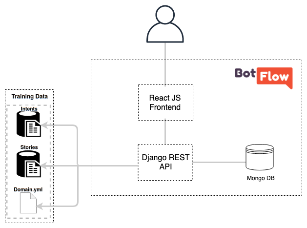

# BotFlow - visual content editor for simple for Rasa chatbots

## About the project
BotFlow is visual content editor for simple [Rasa](https://blog.rasa.com/) chatbots. BotFlow was created by [LAPPIS](https://lappis.rocks).

It was originally part of a project done in partnership with the Brazilian Ministry of Citizenship to create the content for [Tais](https://github.com/lappis-unb/tais), a chatbot for the [culture incentive law](http://leideincentivoacultura.cultura.gov.br/).

* **Want to develop a chatbot using the RASA Framework?? ✏️** [Access Rasa Boiler Plate PTBR](https://github.com/lappis-unb/rasa-ptbr-boilerplate)


## The Architecture

BotFlow is developed using React JS and Redux for the frontend layer. The backend is developed with Django REST, in the [BotFlow API repository](https://github.com/lappis-unb/botFlowAPI).

The frontend is divided in Pages, Components and Ducks:
* **Ducks** - The ducks folder contains the actions and reducers for Intents, Uttters and Stories. It configures the store and have all the functions needed for data manipulation and API connection.
* **Components** - The application pages are componentized, and this folder contain all its separate compontents.
* **Pages** - Contain the website pages.

In [Tais architecture](https://lappis-unb.github.io/tais/documentacao/arquitetura/), this platform generates the training data.



## How does it work?
Botflow allows you to add and edit intents, utters and stories without handling markdown or yaml files. 

### Intents
To add the intents, just go to the Questions page and add examples of user's inputs to that intent. You can also edit or delete a intent by selecting it on the sidebar.


### Utters
To add utters, just go to the Answers page and add your bot's answer. You can edit or delete a existing utter as well, just select it on the sidebar. The utters may be displayed as sequence or chosed between alternatives.


### Stories
A Story is a sequence of intents and utters. To create one, go to Dialogs page and select an existing story or create a new one. You can drag the elements to place it in the correct order. See an example of conversation on the right side of the screen.


### Save Content

After all content is ready, click on the Export Content button on the Navbar and it will download the created content.


## Running the application
 
To run application properly you'll have to run the API as well. To do so, clone the [API repository](https://github.com/lappis-unb/botFlowAPI) and run `docker-compose up`.

Make sure the frontend is linked correctly with your API endpoint by checking the `REACT_APP_URL_API` env variable in the `docker-compose.yml` file on the frontend repository. If you API is running on another server just place the correct DNS or IP address.

After all API configuration is done, to run the application just run the `docker-compose up` command.


## Run the tests

* To run the tests use the command on the app/ folder:

    ``` sh
    npm test
    ```

* To run the tests and see the final coverage run:

    ``` sh
    npm test -- --coverage --watchAll=false
    ```

## License
The entire BotFlow platform is developed under the license [GPL3](https://github.com/lappis-unb/BotFlow/blob/master/LICENSE)

View all the license dependencies [here](https://libraries.io/github/lappis-unb/BotFlow).
